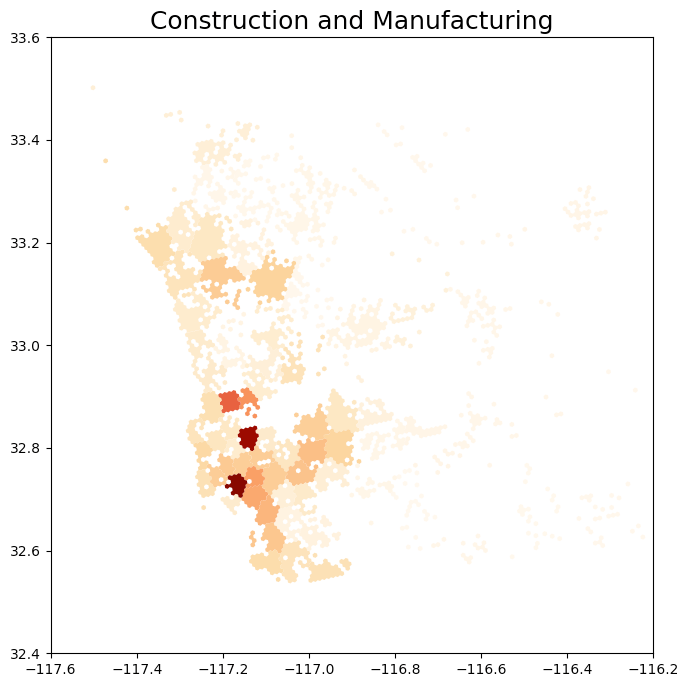
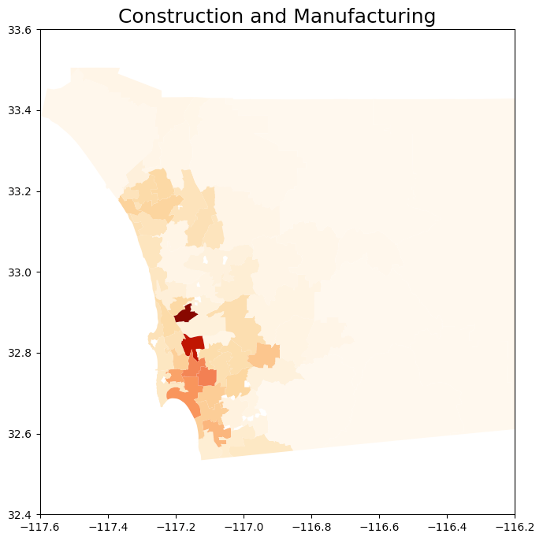
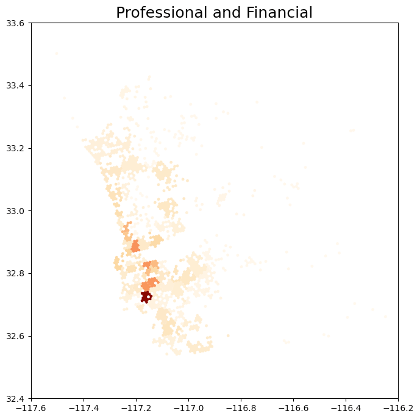
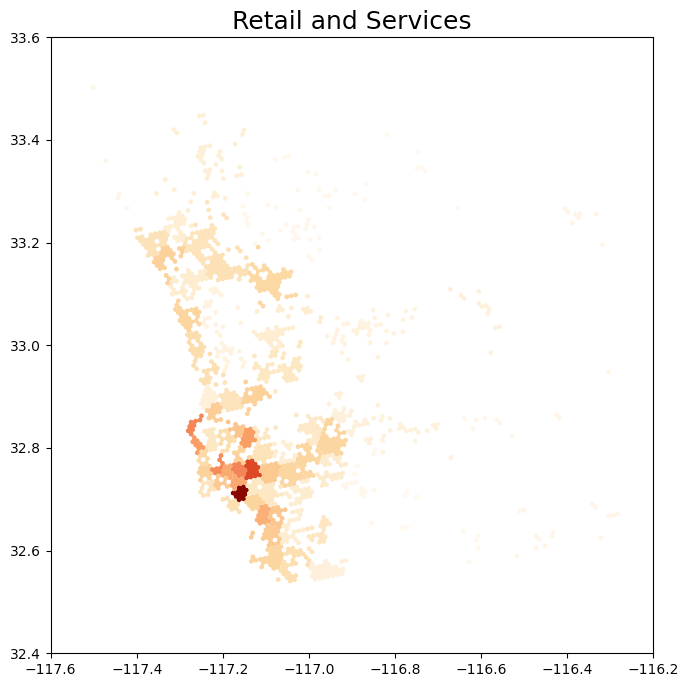
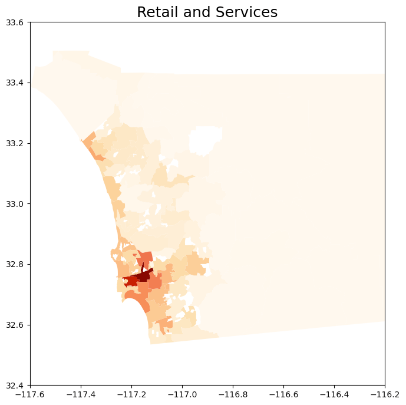

## Table of Contents

- [Introduction](#introduction)
- [Methods](#methods)
- [Results](#results)
- [Discussion](#discussion)
- [Conclusion](#conclusion)
- [References](#references)

## Introduction

### Background / Problem Statement

The San Diego Association of Governments (SANDAG) utilizes data to shape future urban and transportation planning. The San Diego region stands as a burgeoning and dynamic hub for both living and working. In response to this growth, policy makers and regional planners at SANDAG have diligently utilized diverse data sources to create employment centers, crucial for informing future urban and transit planning endeavors. Traditionally, these employment centers have been defined as areas showcasing high concentrations of employment opportunities. However, there exists a need to enhance existing processes by incorporating additional data sources. Activity centers, defined as areas where different categories of businesses in San Diego tend to be located, offer a broader perspective for understanding the region's economic dynamics. These refined centers will not only be indicative of employment opportunities but also offer a holistic representation of the diverse activities characterizing their respective areas.

### Data Collection

- **SANGIS Data:** Comprises coordinates and categories of over 93,000 individual businesses within San Diego county.
- **U.S. Census Bureau Data:** Provides insights into employee commuting patterns and breaks down San Diego regions into tracts.
- **SANDAG Open Data Portal:** Offers a wide variety of data assets and unique data products within the region.

## Methods

### Categorization

Business types were binned into four main categories:

1. Healthcare and Welfare
2. Construction and Manufacturing
3. Professional and Financial
4. Retail and Services

### Hex-bin Approach

1. **Hexagonal Bins:** Aggregate business-level data into 1/4 mile hex-bins to quantify the density of businesses, identifying areas of high concentration.
2. **Identify Activity Centers:** Identify 70 hex-bins with the highest business density.
3. **Distance Clustering:** Apply distance clustering to assign remaining businesses to the hex-bins.

### Census Tract Approach

1. **Utilize Business Sites Data:** Find n (e.g., 70) number of clusters with k-means using business sites data.
2. **Utilize New Clusters:** Use the new clusters to merge existing geometries of Census Tract data, forming new geometries.
3. **Flatten Overlapping Groups:** Use the geometries to flatten potentially overlapping groups and repeat the process with distance clustering.

## Results

The outcome of our methodology is the identification of approximately 70 Activity Centers
across San Diego County, categorized by the dominant type of business activity. These
centers enable the aggregation of summary statistics and the generation of detailed data
visualizations, assisting in the exploration of business-employee interactions within the region. Our approach aligns with the objectives of the San Diego Association of Governments (SANDAG),
providing a foundational tool for urban planning and the development
of public-facing documents that illustrate the economic landscape of San Diego County.

  
  

  
  

  
  

  
  

### Summary Statistics

Summary Statistics for the largest cluster.

## Discussion

#### Comparative Analysis of Hexbin vs. Census Tract Methods

The hex-bin and census tract methodologies reveal similar concentrations of business clusters across San Diego, particularly within the health and welfare sector. Key areas such as La Jolla, Torrey Pines, and Sorrento Valley stand out as major hubs for the biotech industry and hospital locations. Although geo-spatial similarities exist between the two approaches, each comes with its own set of disadvantages and limitations.

#### Hexbin Approach

The hex-bin method minimizes biases associated with pre-existing boundaries, enabling a more nuanced understanding of spatial patterns. By organizing data into uniform hexagonal bins, it allows for the natural emergence of clusters based on data alone, without the constraint of traditional boundaries. This approach facilitates the discovery of clustering patterns unencumbered by external borders. However, its disregard for conventional boundaries can sometimes obscure analyses and make comparisons between different hex-bins challenging.

#### Census Tract Approach

In contrast, the census tract method aligns with pre-existing boundaries, incorporating natural and administrative demarcations such as freeways and other physical landmarks. This alignment aids in comparing clusters with detailed census tract and block-level employment data, enriching the clusters with socioeconomic contexts derived from employment datasets. Nonetheless, this method might produce overly large geometries in areas with sparse business data, potentially misrepresenting the actual distribution of economic activity.

## Conclusion

While both approaches offer valuable insights for the report's purposes, they prioritize different aspects of data representation. Hex-bins focus on an unbiased representation based on data-driven spatial patterns, whereas the census tract approach provides a contextually rich alignment with administrative boundaries, enhancing data comparability and socio-economic interpretation.

### Limitations

The methodology has limitations, notably in not adjusting for businesses' varying impacts based on size or significance. It treats all businesses equally, regardless of employee count or economic output, potentially missing key insights into economic activity distribution. Incorporating weighting schemes that reflect business size could provide a more accurate business activity representation.

Additionally, the model's reliance on infrequently updated data, such as from the San Diego Geographic Information Source (SANDGIS), limits its currentness. A more dynamic and regularly updated data source, coupled with systematic data validation, could enhance the model's accuracy and relevance, ensuring a robust analytical framework.

### Next Steps

1. Display weights onto certain business centers to accurately represent their density.
2. Find more granular data sources to better represent the area with summary statistics.

## Acknowledgments

We extend our gratitude to Dr. Liang Tian and the SANDAG team for their mentorship and opportunity.

## References

1. Employment centers in San Diego downtown.
2. SANDAG open data portal.
3. Tracy Hadden Loh DW Rowlands Adie Tomer Joseph Kane and Jennifer Vey. Mapping America’s activity centers: methodology appendix 2022.
