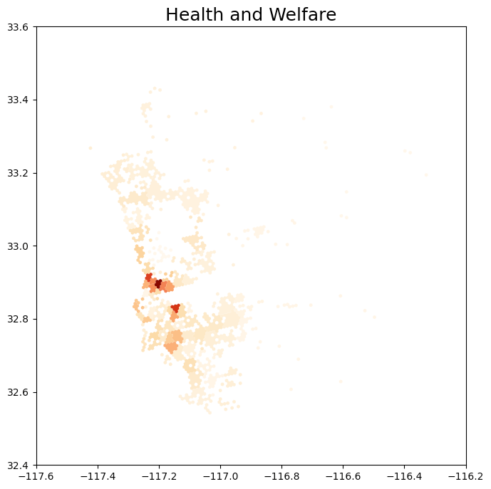
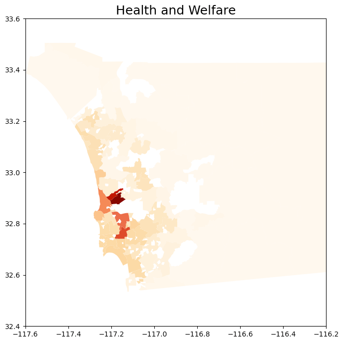
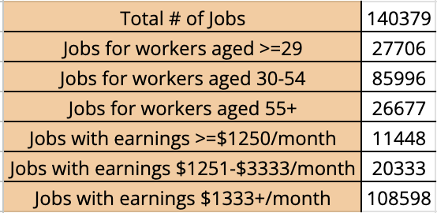

## Table of Contents

- [Introduction](#introduction)
- [Methods](#methods)
- [Results](#results)
- [Conclusion](#conclusion)
- [References](#references)

## Introduction

### Background / Problem Statement

The San Diego Association of Governments (SANDAG) utilizes data to shape future urban and transportation planning. Activity centers, defined as areas where different categories of businesses in San Diego tend to be located, offer a broader perspective for understanding the region's economic dynamics.

### Data Collection

- **SANGIS Data:** Comprises coordinates and categories of over 93,000 individual businesses within San Diego county.
- **U.S. Census Bureau Data:** Provides insights into employee commuting patterns and breaks down San Diego regions into tracts.
- **SANDAG Open Data Portal:** Offers a wide variety of data assets and unique data products within the region.

## Methods

### Categorization

Business types were binned into four main categories:
1. Healthcare and Welfare
2. Construction and Manufacturing
3. Professional and Financial
4. Retail and Services

### Hex-bin Approach

1. **Hexagonal Bins:** Aggregate business-level data into 1/4 mile hex-bins to quantify the density of businesses, identifying areas of high concentration.
2. **Identify Activity Centers:** Identify 70 hex-bins with the highest business density.
3. **Distance Clustering:** Apply distance clustering to assign remaining businesses to the hex-bins.

### Census Tract Approach

1. **Utilize Business Sites Data:** Find n (e.g., 70) number of clusters with k-means using business sites data.
2. **Utilize New Clusters:** Use the new clusters to merge existing geometries of Census Tract data, forming new geometries.
3. **Flatten Overlapping Groups:** Use the geometries to flatten potentially overlapping groups and repeat the process with distance clustering.

## Results

### Summary Statistics

  
  

### Discussion

Comparison between the two methods reveals similar hot spots in terms of cluster grouping, with each method having its benefits and drawbacks.

## Conclusion

The study identified 70 clusters of different categories of activity centers and derived summary statistics towards Census Tract, highlighting the benefits and drawbacks of aggregating by hex-bin or Census Tract.

### Limitations

- Activity weight business sites did not account for the weight of their employees, leading to an equal representation of all businesses regardless of size.
- Limitations on data: The dataset used by SANGIS was not frequently updated, necessitating more data accumulation for future robustness.

### Next Steps

1. Display weights onto certain business centers to accurately represent their density.
2. Find more granular data sources to better represent the area with summary statistics.

## Acknowledgments

We extend our gratitude to Dr. Liang Tian and the SANDAG team for their mentorship and opportunity.

## References

1. Employment centers in San Diego downtown.
2. SANDAG open data portal.
3. Tracy Hadden Loh DW Rowlands Adie Tomer Joseph Kane and Jennifer Vey. Mapping America’s activity centers: methodology appendix 2022.
